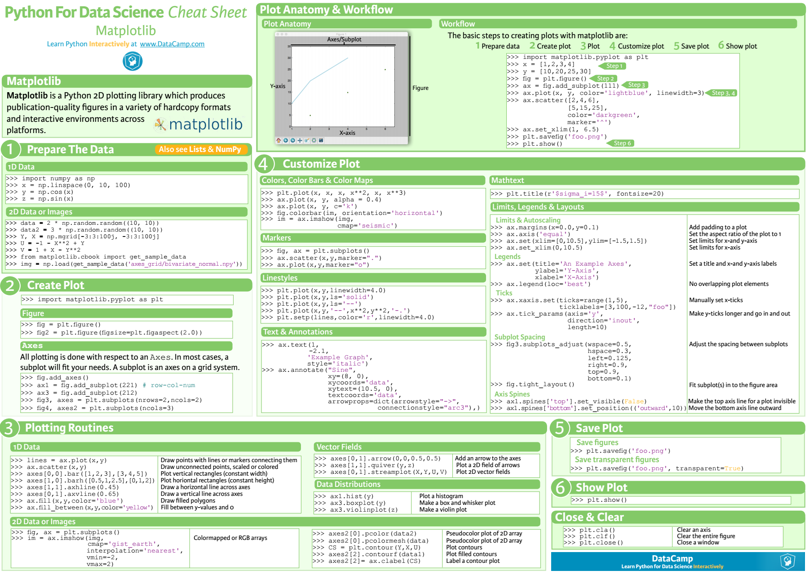
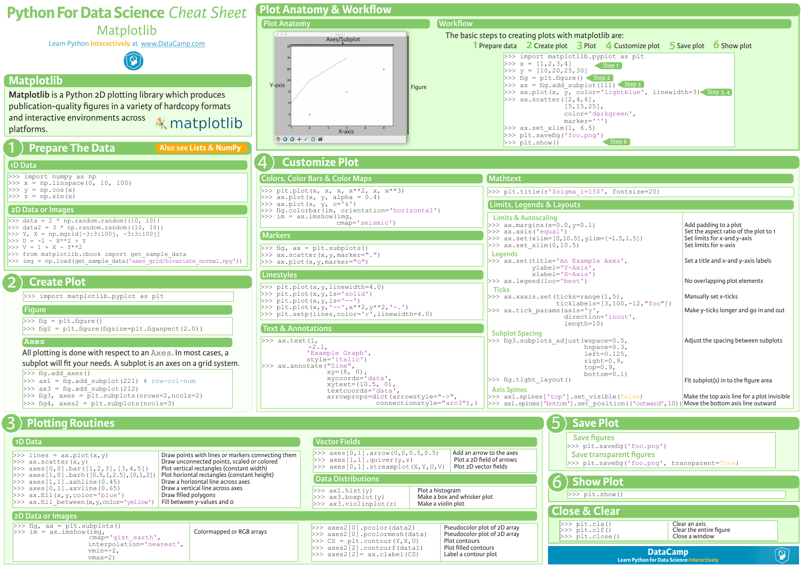

We can view the rendered version of notebook using [nbviewer](http://nbviewer.ipython.org/github/bhishanpdl/pdl_practice/tree/master).

http://htmlpreview.github.io/?https://github.com/bhishanpdl/pdl_practice/blob/master/plot.html

# practice
:tada:  :truck:

